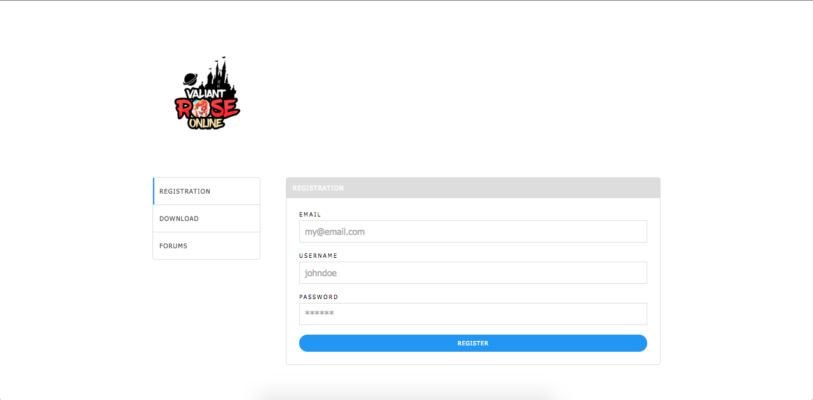

## toroku
Web user registration for Valiant ROSE Online

## Installation
- Clone the repository
- Install dependencies
```bash
$composer install
```
- Migrate database
```
$ artisan migrate
```
- Copy `.env.example` to `.env`.
```
$ cp .env.example .env
```
- Then configure (especially the email configuration and download link).
```bash
MAIL_USERNAME=<YOUR_EMAIL>
MAIL_PASSWORD=<YOUR_PASSWORD>

VALIANT_CLIENT_DOWNLOAD_URL=<DL_URL>
VALIANT_CLIENT_MIRROR_URL_1=<DL_URL_1>
VALIANT_CLIENT_MIRROR_URL_2=<DL_URL_2>
VALIANT_CLIENT_MIRROR_URL_3=<DL_URL_3>
VALIANT_CLIENT_MIRROR_URL_4=<DL_URL_4>
VALIANT_CLIENT_MIRROR_URL_5=<DL_URL_5>
```

## Preview
